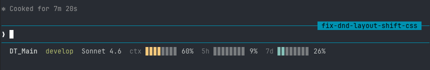

# status-bar-claude

A shell script that renders a real-time Claude Code status line in your terminal.



### Status bar elements

```
DT_Main   develop   Sonnet 4.6   ctx ▊▊▊▊▊▊▊▊ 60%   5h ▊▊▊▊▊▊▊▊ 9%   7d ▊▊▊▊▊▊▊▊ 26%
  │          │           │             │                    │                  │
  │          │           │             │                    │                  └─ 7-day token usage
  │          │           │             │                    └─ 5-hour token usage
  │          │           │             └─ Context window usage
  │          │           └─ Model name
  │          └─ Git branch (omitted if not in a repo)
  └─ Current working directory
```

**Bar colors:** cyan → yellow (50%) → red (75%) → bold red (90%)

## Requirements

- `bash`
- `jq`
- `git`

## Installation

### 1. Copy the script to your Claude config directory

```bash
cp statusline-command.sh ~/.claude/statusline-command.sh
chmod +x ~/.claude/statusline-command.sh
```

### 2. Configure Claude Code

In `~/.claude/settings.json`, add:

```json
{
  "statusLine": {
    "type": "command",
    "command": "bash ~/.claude/statusline-command.sh"
  }
}
```

The script reads JSON from stdin (provided by Claude Code) and prints a colored status string to stdout.
